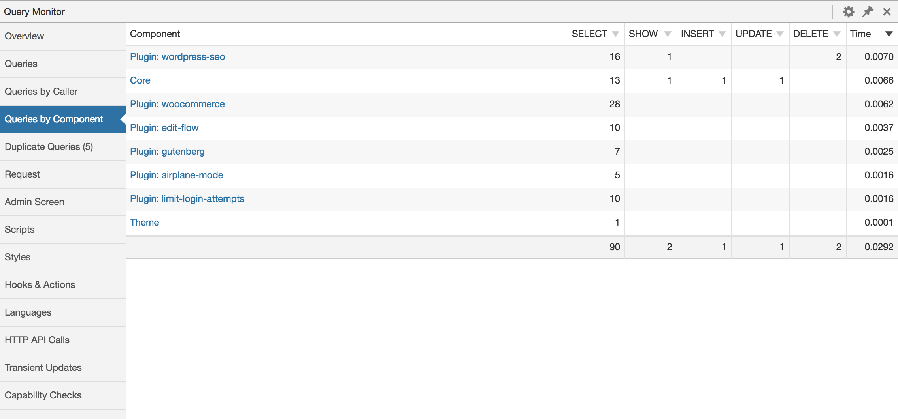
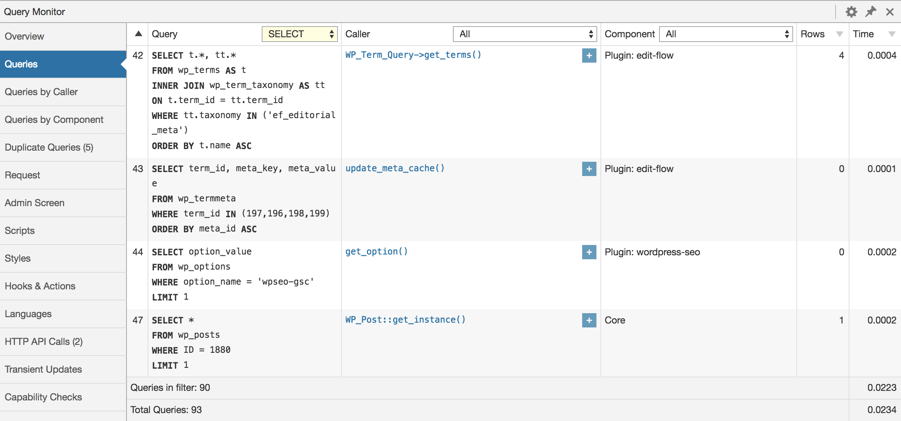
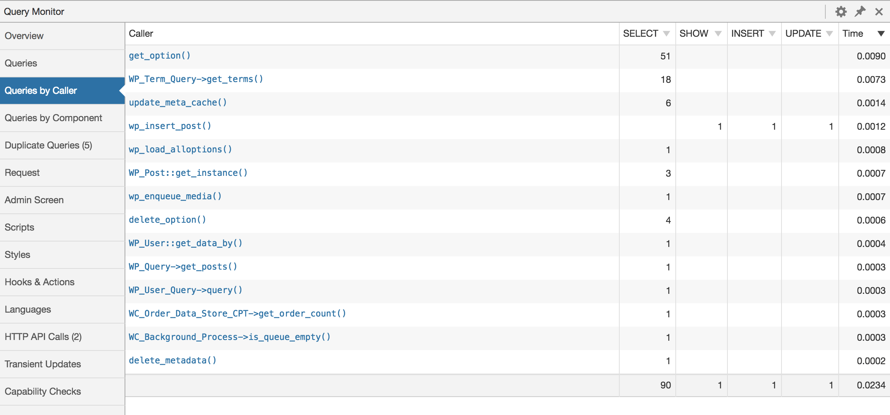
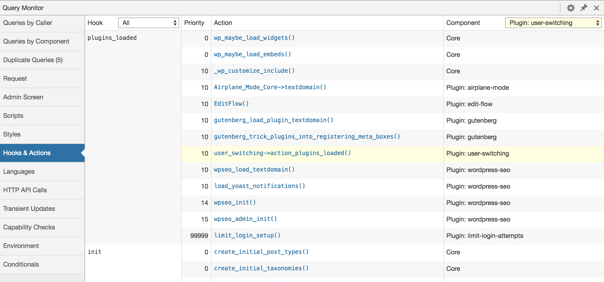

[](https://wordpress.org/plugins/query-monitor/)
[](http://opensource.org/licenses/GPL-2.0)
[](https://wordpress.org/plugins/query-monitor/)
[](https://github.com/johnbillion/query-monitor/actions)

# Query Monitor

Query Monitor is the developer tools panel for WordPress. It enables debugging of database queries, PHP errors, hooks and actions, block editor blocks, enqueued scripts and stylesheets, HTTP API calls, and more.

It includes some advanced features such as debugging of Ajax calls, REST API calls, and user capability checks. It includes the ability to narrow down much of its output by plugin or theme, allowing you to quickly determine poorly performing plugins, themes, or functions.

Query Monitor focuses heavily on presenting its information in a useful manner, for example by showing aggregate database queries grouped by the plugins, themes, or functions that are responsible for them. It adds an admin toolbar menu showing an overview of the current page, with complete debugging information shown in panels once you select a menu item.

Here's an example of Query Monitor's output. This is the panel showing aggregate database queries grouped by component:



---

 * [Features](#features)
    * [Database Queries](#database-queries)
    * [Hooks](#hooks)
    * [Theme](#theme)
    * [PHP Errors](#php-errors)
    * [Request](#request)
    * [Scripts & Styles](#scripts--styles)
    * [Languages](#languages)
    * [HTTP API Requests](#http-api-requests)
    * [Redirects](#redirects)
    * [Ajax](#ajax)
    * [REST API](#rest-api)
    * [Admin Screen](#admin-screen)
    * [Environment Information](#environment-information)
    * [Logging](#logging)
    * [Profiling](#profiling)
    * [Everything Else](#everything-else)
 * [Notes](#notes)
    * [Implementation](#a-note-on-query-monitors-implementation)
 * [Screenshots](#screenshots)
 * [FAQ](#frequently-asked-questions)
 * [Privacy Statement](#privacy-statement)
 * [Related Tools](#related-tools)
 * [Contributing](#contributing)
 * [Icon](#icon)
 * [License](#license-gplv2)

---

# Features

## Database Queries

 * Shows all database queries performed on the current request
 * Shows affected rows and time for all queries
 * Shows notifications for slow queries, duplicate queries, and queries with errors
 * Filter queries by query type (`SELECT`, `UPDATE`, `DELETE`, etc)
 * Filter queries by component (WordPress core, Plugin X, Plugin Y, theme)
 * Filter queries by calling function
 * View aggregate query information grouped by component, calling function, and type
 * Super advanced: Supports multiple instances of wpdb (more info in the FAQ)

Filtering queries by component or calling function makes it easy to see which plugins, themes, or functions on your site are making the most (or the slowest) database queries.

## Hooks

 * Shows all hooks fired on the current request, along with hooked actions, their priorities, and their components
 * Filter hooks by part of their name
 * Filter actions by component (WordPress core, Plugin X, Plugin Y, theme)

## Theme

 * Shows the template filename for the current request
 * Shows the complete template hierarchy for the current request (WordPress 4.7+)
 * Shows all template parts loaded or not loaded on the current request
 * Shows the available body classes for the current request
 * Shows the active theme name

## PHP Errors

 * PHP errors (warnings, notices, stricts, and deprecated) are presented nicely along with their component and call stack
 * Shows a visible warning in the admin toolbar

## Block Content

 * Post content blocks and associated information (when using WordPress 5.0+ or the Gutenberg plugin)

## Request

 * Shows query vars for the current request, and highlights custom query vars
 * Shows all matched rewrite rules and associated query strings

## Scripts & Styles

 * Shows all enqueued scripts and styles on the current request, along with their URL and version
 * Shows their dependencies and dependents, and alerts you to any broken dependencies

## Languages

 * Shows you language settings and text domains
 * Shows you the MO files for each text domain and which ones were loaded or not

## HTTP API Requests

 * Shows all server-side HTTP requests performed on the current request (as long as they use the WordPress HTTP API)
 * Shows the response code, call stack, component, timeout, and time taken
 * Highlights erroneous responses, such as failed requests and anything without a `200` response code

## User Capability Checks

 * Shows every user capability check that is performed on the page, along with the result and any parameters passed along with the capability check.

## Redirects

 * Whenever a redirect occurs, Query Monitor adds an `X-QM-Redirect` HTTP header containing the call stack, so you can use your favourite HTTP inspector or browser developer tools to trace where a redirect has come from.

## Ajax

The response from any jQuery Ajax request on the page will contain various debugging information in its headers. Any errors also get output to the developer console. No hooking required.

Currently this includes PHP errors and some overview information such as memory usage, but this will be built upon in future versions.

## REST API

The response from an authenticated WordPress REST API (v2 or later) request will contain various debugging information in its headers, as long as the authenticated user has permission to view Query Monitor's output.

Currently this includes PHP errors and overview information.

To see more detailed information about a REST API request you need to perform [an enveloped request](https://developer.wordpress.org/rest-api/using-the-rest-api/global-parameters/#_envelope) which means appending `?_envelope` to the requested URL. In this case, Query Monitor will include debugging data in a `qm` property in the response. Currently this includes database queries (including information about duplicates and errors), HTTP API requests, and transient updates. More information may be added in a future version.

By using the combination of the HTTP headers and the `qm` property in the response to an enveloped request you'll get good insight into the aspects of a request which have the greatest impact on performance.

## Admin Screen

 * Shows the correct names for custom column filters and actions on all admin screens that have a listing table
 * Shows the state of `get_current_screen()` and a few variables

## Environment Information

 * Shows various PHP information such as memory limit and error reporting levels
 * Highlights the fact when any of these are overridden at runtime
 * Shows various MySQL information, including caching and performance related configuration
 * Highlights the fact when any performance related configurations are not optimal
 * Shows various details about WordPress and the web server
 * Shows version numbers for all the things

## Logging

Debugging messages can be sent to the Logs panel in Query Monitor using actions in your code:

```php
do_action( 'qm/debug', 'This happened!' );
```

The logger is PSR-3 compatible, so you can use any of the following actions which correspond to PSR-3 log levels:

 * `qm/emergency`
 * `qm/alert`
 * `qm/critical`
 * `qm/error`
 * `qm/warning`
 * `qm/notice`
 * `qm/info`
 * `qm/debug`

A log level of `warning` or higher will trigger a notification in Query Monitor's admin toolbar.

Contextual interpolation can be used via the curly brace syntax:

```php
do_action( 'qm/warning', 'Unexpected value of {foo} encountered', [
    'foo' => $foo,
] );
```

A `WP_Error`, `Exception`, or `Throwable` object can be passed directly into the logger:

```php
if ( is_wp_error( $response ) ) {
    do_action( 'qm/error', $response );
}
```

```php
try {
    // your code
} catch ( Exception $e ) {
    do_action( 'qm/error', $e );
}
```

A non-scalar value can be passed to the logger and its value will be formatted and output in the same panel. Can be used as a replacement for `var_dump()`:

```php
do_action( 'qm/debug', get_queried_object() );
```

Finally, the static logging methods on the `QM` class can be used instead of calling `do_action()`.

```php
QM::error( 'Everything is broken' );
```

## Profiling

Basic profiling can be performed and displayed in the Timings panel in Query Monitor using actions in your code:

```php
// Start the 'foo' timer:
do_action( 'qm/start', 'foo' );

// Run some code
my_potentially_slow_function();

// Stop the 'foo' timer:
do_action( 'qm/stop', 'foo' );
```

The time taken and approximate memory usage used between the `qm/start` and `qm/stop` actions for the given function name will be recorded and shown in the Timings panel. Timers can be nested, although be aware that this reduces the accuracy of the memory usage calculations.

Timers can also make use of laps with the `qm/lap` action:

```php
// Start the 'bar' timer:
do_action( 'qm/start', 'bar' );

// Iterate over some data:
foreach ( range( 1, 10 ) as $i ) {
    my_potentially_slow_function( $i );
    do_action( 'qm/lap', 'bar' );
}

// Stop the 'bar' timer:
do_action( 'qm/stop', 'bar' );
```

Note that the times and memory usage displayed in the Timings panel should be treated as approximations, because they are recorded at the PHP level and can be skewed by your environment and by other code. If you require highly accurate timings, you'll need to use a low level profiling tool such as XHProf. See the [Related Tools](#related-tools) section for more information.

## Everything Else

 * Shows any transients that were set, along with their timeout, component, and call stack
 * Shows all WordPress conditionals on the current request, highlighted nicely
 * Shows an overview at the top, including page generation time and memory limit as absolute values and as % of their respective limits

## Authentication

By default, Query Monitor's output is only shown to Administrators on single-site installations, and Super Admins on Multisite installations.

In addition to this, you can set an authentication cookie which allows you to view Query Monitor output when you're not logged in, or when you're logged in as a user who cannot usually see Query Monitor's output. See the Settings panel for details.

# Notes

## A Note on Query Monitor's Implementation

In order to do a few clever things, Query Monitor symlinks a custom `db.php` into your `WP_CONTENT_DIR` which means it loads very early. This file gets included before the database driver is loaded, meaning this portion of Query Monitor loads before WordPress even engages its brain.

In this file is Query Monitor's extension to the `wpdb` class which:

 * Allows it to log details about **all** database queries (including ones that happen before plugins are loaded)
 * Logs the full stack trace for each query, which allows it to determine the component that's responsible for the query
 * Logs the query result, which allows it to display the affected rows or error message if applicable
 * Logs various PHP configurations before anything has loaded, which allows it to display a message if these get altered at runtime by a plugin or theme

If your `WP_CONTENT_DIR` isn't writable and therefore the symlink for `db.php` can't be put in place, Query Monitor still functions, but this extended functionality won't be available. You can [manually create the db.php symlink](https://github.com/johnbillion/query-monitor/wiki/db.php-Symlink) if you have permission.

# Screenshots

## Admin Toolbar Menu


## Database Queries



## Capability Checks


## Aggregate Database Queries by Component


## Aggregate Database Queries by Calling Function



## Hooks and Actions



## HTTP API Requests


# Frequently Asked Questions

## Does this plugin work with PHP 8?

Yes.

## Who can see Query Monitor's output?

By default, Query Monitor's output is only shown to Administrators on single-site installations, and Super Admins on Multisite installations.

In addition to this, you can set an authentication cookie which allows you to view Query Monitor output when you're not logged in, or when you're logged in as a user who cannot usually see Query Monitor's output. See the Settings panel for details.

## Does Query Monitor itself impact the page generation time or memory usage?

Short answer: Yes, but only a little.

Long answer: Query Monitor has a small impact on page generation time because it hooks into a few places in WordPress in the same way that other plugins do. The impact is negligible.

On pages that have an especially high number of database queries (in the hundreds), Query Monitor currently uses more memory than I would like it to. This is due to the amount of data that is captured in the stack trace for each query. I have been and will be working to continually reduce this.

## Can I prevent Query Monitor from collecting data during long-running requests?

Yes, if anything calls `do_action( 'qm/cease' )` then Query Monitor will cease operating for the remainder of the page generation. It detaches itself from further data collection, discards any data it's collected so far, and skips the output of its information.

This is useful for long-running operations that perform a very high number of database queries, consume a lot of memory, or otherwise are of no concern to Query Monitor, for example:

* Backuping up or restoring your site
* Exporting a large amount of data
* Running security scans

## Are there any add-on plugins for Query Monitor?

[A list of add-on plugins for Query Monitor can be found here.](https://github.com/johnbillion/query-monitor/wiki/Query-Monitor-Add-on-Plugins)

In addition, Query Monitor transparently supports add-ons for the Debug Bar plugin. If you have any Debug Bar add-ons installed, deactivate Debug Bar and the add-ons will show up in Query Monitor's menu.

## Where can I suggest a new feature or report a bug?

Please use [the issue tracker on Query Monitor's GitHub repo](https://github.com/johnbillion/query-monitor/issues) as it's easier to keep track of issues there, rather than on the wordpress.org support forums.

## Is Query Monitor available on Altis?

Yes, the [Altis Developer Tools](https://www.altis-dxp.com/resources/developer-docs/dev-tools/) are built on top of Query Monitor.

## Is Query Monitor available on WordPress.com VIP Go?

Yep! However, a user needs to be granted the `view_query_monitor` capability to see Query Monitor even if they're an administrator.

Please note that information about database queries and the environment is somewhat restricted on VIP. This is a platform restriction and not a Query Monitor issue.

## I'm using multiple instances of `wpdb`. How do I get my additional instances to show up in Query Monitor?

You'll need to hook into the `qm/collect/db_objects` filter and add an item to the array containing your `wpdb` instance. For example:

    add_filter( 'qm/collect/db_objects', function( $objects ) {
        $objects['my_db'] = $GLOBALS['my_db'];
        return $objects;
    } );

Your `wpdb` instance will then show up as a separate panel, and the query time and query count will show up separately in the admin toolbar menu. Aggregate information (queries by caller and component) will not be separated.

## Can I click on stack traces to open the file in my editor?

Yes! You can enable this on the Settings panel.

## Do you accept donations?

[I am accepting sponsorships via the GitHub Sponsors program](https://johnblackbourn.com/donations/) and any support you can give will help me maintain this plugin and keep it free for everyone.

In addition, if you like the plugin then I'd love for you to [leave a review](https://wordpress.org/support/view/plugin-reviews/query-monitor). Tell all your friends about it too!

# Privacy Statement

Query Monitor is private by default and always will be. It does not persistently store any of the data that it collects. It does not send data to any third party, nor does it include any third party resources.

[Query Monitor's full privacy statement can be found here](https://github.com/johnbillion/query-monitor/wiki/Privacy-Statement).

# Related Tools

Debugging is rarely done with just one tool. Along with Query Monitor, you should be aware of other plugins and tools which aid in debugging and profiling your website. Here are some examples:

 * [Tideways](https://tideways.com/profiler/xhprof-for-php7) or [XHProf](https://github.com/phacility/xhprof) for low level profiling of PHP.
 * [Xdebug](https://xdebug.org/) for a host of PHP debugging tools.
 * [P3 Profiler](https://wordpress.org/plugins/p3-profiler/) for performance trend analysis of the plugins in use on your site.
 * [Time Stack](https://github.com/joehoyle/Time-Stack) for WordPress-specific operation profiling.
 * [Laps](https://github.com/Rarst/laps) for lightweight WordPress profiling.
 * [Clockwork](https://github.com/itsgoingd/clockwork) for debugging and profiling PHP applications.
 * [Blackfire](https://blackfire.io/) for PHP performance testing.
 * [New Relic](https://newrelic.com/) for complete software performance analytics.

Query Monitor also has [several add-on plugins](https://github.com/johnbillion/query-monitor/wiki/Query-Monitor-Add-on-Plugins) which extend its functionality, and transparently supports add-ons for the Debug Bar plugin (see the FAQ for more info).

See also my list of [WordPress Developer Plugins](https://johnblackbourn.com/wordpress-developer-plugins).

# Contributing

Code contributions, feedback, and feature suggestions are very welcome. See [CONTRIBUTING.md](https://github.com/johnbillion/query-monitor/blob/master/CONTRIBUTING.md) for more details.

# Icon

Query Monitor's icon was designed by [Tubagus Didin Asrori](https://www.instagram.com/asrorigus/).

# License: GPLv2

This program is free software; you can redistribute it and/or modify
it under the terms of the GNU General Public License as published by
the Free Software Foundation; either version 2 of the License, or
(at your option) any later version.

This program is distributed in the hope that it will be useful,
but WITHOUT ANY WARRANTY; without even the implied warranty of
MERCHANTABILITY or FITNESS FOR A PARTICULAR PURPOSE.  See the
GNU General Public License for more details.
