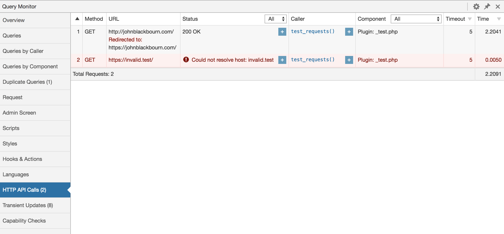

[](https://wordpress.org/plugins/query-monitor/)
[](http://opensource.org/licenses/GPL-2.0)
[](https://wordpress.org/plugins/query-monitor/)
[](https://github.com/johnbillion/query-monitor/actions)

# Query Monitor

Query Monitor is the developer tools panel for WordPress. It enables debugging of database queries, PHP errors, hooks and actions, block editor blocks, enqueued scripts and stylesheets, HTTP API calls, and more.

It includes some advanced features such as debugging of Ajax calls, REST API calls, user capability checks, and full support for block themes and full site editing. It includes the ability to narrow down much of its output by plugin or theme, allowing you to quickly determine poorly performing plugins, themes, or functions.

Query Monitor focuses heavily on presenting its information in a useful manner. Here's an example showing aggregate database queries grouped by the components responsible for them:


---

## Features

### Database Queries

 * Shows all database queries performed during the current request
 * Shows affected rows and time taken for all queries
 * Shows notifications for slow queries, duplicate queries, and queries with errors
 * Shows aggregate query information grouped by type, component, or calling function
 * Queries can be filtered by query type, component, or calling function

Filtering queries by component or calling function makes it easy to see which plugins, themes, or functions on your site are making the most (or the slowest) database queries.

### Hooks & Actions

 * Shows all hooks fired during the current request, along with action callbacks, priorities, and components
 * Actions can be filtered by component or name

### Theme

 * Shows the template filename and complete template hierarchy
 * Shows all template parts that were requested, and whether they were loaded or not
 * Shows the available body classes
 * Fully supports block themes and full site editing (FSE)

### PHP Errors

 * Shows PHP warnings, notices, stricts, and deprecated errors, formatted nicely along with their component and call stack
 * Shows a visible warning in the admin toolbar when necessary

### Doing it Wrong

 * Shows usage of "Doing it Wrong" or "Deprecated" functionality in the code on your site

### Block Content

 * Shows blocks and associated information from post content and full site editing

### Request

 * Shows information about matched URL rewrite rules for the request and corresponding query parameters
 * Shows query variables and highlights any that are custom

### Scripts & Styles

 * Shows all enqueued scripts and styles along with their handle, URL, and version
 * Shows their dependencies and dependents
 * Alerts you to any broken or missing dependencies
 * Supports the script modules feature added in WordPress 6.5

### Languages

 * Shows you language settings and loaded text domains
 * Shows you the requested MO, JSON, and PHP translation files for each text domain and which ones were loaded

### HTTP API Requests

 * Shows all server-side HTTP requests (as long as they use the WordPress HTTP API)
 * Shows the response code, call stack, component, timeout, response size, time taken, and other meta data
 * Alerts you to erroneous responses, such as failed requests and anything without a `200` response code

### User Capability Checks

 * Shows every user capability check that is performed, along with the result and any parameters passed along with the capability check

### Multisite

 * Shows all calls to `switch_to_blog()` and `restore_current_blog()` on Multisite installations

### Redirects

 * Whenever a server-side redirect occurs, Query Monitor adds an `X-QM-Redirect` HTTP header containing the call stack, so you can use your favourite HTTP inspector or browser developer tools to trace where a redirect has come from

### Ajax

The response from any jQuery Ajax request on the page will contain various debugging information in its headers. Any errors also get output to the developer console. No hooking required.

Currently this includes PHP errors and some overview information such as memory usage, but this will be built upon in future versions.

### REST API

The response from an authenticated WordPress REST API request will contain various debugging information in its headers, as long as the authenticated user has permission to view Query Monitor's output.

[Read more about debugging REST API requests with Query Monitor](https://querymonitor.com/wordpress-debugging/rest-api-requests/).

### Admin Screen

 * Shows the correct names for custom column filters and actions on all admin screens that use a list table
 * Shows the state of `get_current_screen()` and a few global variables

### Environment Information

 * Shows PHP information such as memory limit, error reporting levels, and values of various constants
 * Shows MySQL or MariaDB information, including caching and performance related configuration
 * Shows information about WordPress and the web server
 * Shows version numbers for all the things

### Logging

Debugging messages can be sent to the Logs panel using actions. This works as a good replacement for `var_dump()`:

```php
do_action( 'qm/debug', 'This happened!' );
```

The logger is PSR-3 compatible, so you can use any of the following actions which correspond to PSR-3 log levels:

 * `qm/debug`
 * `qm/info`
 * `qm/notice`
 * `qm/warning`
 * `qm/error`
 * `qm/critical`
 * `qm/alert`
 * `qm/emergency`

A log level of `warning` or higher will trigger a notification in Query Monitor's admin toolbar.

[Read more about profiling and logging in Query Monitor](https://querymonitor.com/wordpress-debugging/profiling-and-logging/).

### Profiling

Basic performance profiling can be displayed in the Timings panel using actions in your code:

```php
// Start the 'foo' timer:
do_action( 'qm/start', 'foo' );

// Run some code
my_potentially_slow_function();

// Stop the 'foo' timer:
do_action( 'qm/stop', 'foo' );
```

[Read more about profiling and logging in Query Monitor](https://querymonitor.com/wordpress-debugging/profiling-and-logging/).

### Everything Else

 * Shows any transients that were set, along with their timeout, component, and call stack
 * Shows all WordPress conditionals during the current request, highlighted nicely
 * Shows an overview at the top, including page generation time and memory limit as absolute values and as % of their respective limits

### Authentication

By default, Query Monitor's output is only shown to Administrators on single-site installations, and Super Admins on Multisite installations.

In addition to this, you can set an authentication cookie which allows you to view Query Monitor output when you're not logged in, or when you're logged in as a user who cannot usually see Query Monitor's output. See the Settings panel for details.

## Notes

### A Note on Query Monitor's Implementation

In order to do a few clever things, Query Monitor symlinks a custom `db.php` into your `WP_CONTENT_DIR` which means it loads very early. This file gets included before the database driver is loaded, meaning this portion of Query Monitor loads before WordPress even engages its brain.

In this file is Query Monitor's extension to the `wpdb` class which:

 * Allows it to log details about **all** database queries (including ones that happen before plugins are loaded)
 * Logs the full stack trace for each query, which allows it to determine the component that's responsible for the query
 * Logs the query result, which allows it to display the affected rows or error message if applicable

If your `WP_CONTENT_DIR` isn't writable and therefore the symlink for `db.php` can't be put in place, Query Monitor still functions, but this extended functionality won't be available. You can [manually create the db.php symlink](https://querymonitor.com/help/db-php-symlink/) if you have permission.

## Screenshots

### Admin Toolbar Menu


### Database Queries


### Capability Checks


### Aggregate Database Queries by Component


### Aggregate Database Queries by Calling Function


### Hooks and Actions


### HTTP API Requests



## Frequently Asked Questions

### Does this plugin work with PHP 8?

Yes, it's actively tested and working up to PHP 8.2.

### Who can see Query Monitor's output?

By default, Query Monitor's output is only shown to Administrators on single-site installations, and Super Admins on Multisite installations.

In addition to this, you can set an authentication cookie which allows you to view Query Monitor output when you're not logged in, or when you're logged in as a user who cannot usually see Query Monitor's output. See the Settings panel for details.

### Does Query Monitor itself impact the page generation time or memory usage?

Short answer: Yes, but only a little.

Long answer: Query Monitor has a small impact on page generation time because it hooks into a few places in WordPress in the same way that other plugins do. The impact is negligible.

On pages that have an especially high number of database queries (in the hundreds), Query Monitor currently uses more memory than I would like it to. This is due to the amount of data that is captured in the stack trace for each query. I have been and will be working to continually reduce this.

### Can I prevent Query Monitor from collecting data during long-running requests?

Yes, you can call `do_action( 'qm/cease' )` to instruct Query Monitor to cease operating for the remainder of the page generation. It will detach itself from further data collection, discard any data it's collected so far, and skip the output of its information.

This is useful for long-running operations that perform a very high number of database queries, consume a lot of memory, or otherwise are of no concern to Query Monitor, for example:

* Backing up or restoring your site
* Importing or exporting a large amount of data
* Running security scans

### Are there any add-on plugins for Query Monitor?

[A list of add-on plugins for Query Monitor can be found here.](https://querymonitor.com/help/add-on-plugins/)

In addition, Query Monitor transparently supports add-ons for the Debug Bar plugin. If you have any Debug Bar add-ons installed, deactivate Debug Bar and the add-ons will show up in Query Monitor's menu.

### Where can I suggest a new feature or report a bug?

Please use [the issue tracker on Query Monitor's GitHub repo](https://github.com/johnbillion/query-monitor/issues) as it's easier to keep track of issues there, rather than on the wordpress.org support forums.

### Is Query Monitor available on Altis?

Yes, the [Altis Developer Tools](https://www.altis-dxp.com/resources/developer-docs/dev-tools/) are built on top of Query Monitor.

### Is Query Monitor available on WordPress.com VIP?

Yes, but a user needs to be granted the `view_query_monitor` capability to see Query Monitor even if they're an administrator. [See the WordPress.com VIP documentation for more details](https://docs.wpvip.com/how-tos/enable-query-monitor/).

### I'm using multiple instances of `wpdb`. How do I get my additional instances to show up in Query Monitor?

This feature was removed in version 3.12 as it was rarely used and considerably increased the maintenance burden of Query Monitor itself. Feel free to continue using version 3.11 if you need to make use of this feature.

### Can I click on stack traces to open the file in my editor?

Yes! You can enable this on the Settings panel.

### Do you accept donations?

[I am accepting sponsorships via the GitHub Sponsors program](https://github.com/sponsors/johnbillion). If you work at an agency that develops with WordPress, ask your company to provide sponsorship in order to invest in its supply chain. The tools that I maintain probably save your company time and money, and GitHub sponsorship can now be done at the organisation level.

In addition, if you like the plugin then I'd love for you to [leave a review](https://wordpress.org/support/view/plugin-reviews/query-monitor). Tell all your friends about it too!

## Privacy Statement

Query Monitor is private by default and always will be. It does not persistently store any of the data that it collects. It does not send data to any third party, nor does it include any third party resources.

[Query Monitor's full privacy statement can be found here](https://querymonitor.com/privacy/).

## Accessibility Statement

Query Monitor aims to be fully accessible to all of its users. It implements best practices for web accessibility, outputs semantic and structured markup, uses the accessibility APIs provided by WordPress and web browsers where appropriate, and is fully accessible via keyboard.

That said, Query Monitor does _not_ conform to the Web Content Accessibility Guidelines (WCAG) 2.0 at level AA like WordPress itself does. The main issue is that the user interface uses small font sizes to maintain a high information density for sighted users. Users with poor vision or poor motor skills may struggle to view or interact with some areas of Query Monitor because of this. This is something which I'm acutely aware of and which I work to gradually improve, but the underlying issue of small font sizes remains.

If you've experienced or identified another accessibility issue in Query Monitor, please open a thread in [the Query Monitor plugin support forum](https://wordpress.org/support/plugin/query-monitor/) and I'll try my best to address it swiftly.

## Related Tools

Debugging is rarely done with just one tool. Along with Query Monitor you should be aware of other plugins and tools for debugging and profiling your website. Here are some recommendations:

### WordPress Plugins

 * [Block X-ray Attributes](https://wordpress.org/plugins/block-xray-attributes/)
 * [Code Profiler](https://wordpress.org/plugins/code-profiler/)
 * [Debug This](https://wordpress.org/plugins/debug-this/)
 * [Decalog](https://wordpress.org/plugins/decalog/)
 * [Laps](https://github.com/Rarst/laps)
 * [Log HTTP Requests](https://wordpress.org/plugins/log-http-requests/)
 * [Rewrite Rules Inspector](https://wordpress.org/plugins/rewrite-rules-inspector/)
 * [Time Stack](https://github.com/joehoyle/Time-Stack)
 * [User Switching](https://wordpress.org/plugins/user-switching/)
 * [Variable Inspector](https://wordpress.org/plugins/variable-inspector/)
 * [WP Crontrol](https://wordpress.org/plugins/wp-crontrol/)

Query Monitor also has [several add-on plugins](https://querymonitor.com/help/add-on-plugins/) which extend its functionality, and transparently supports add-ons for the Debug Bar plugin (see the FAQ for more info).

See also my list of [WordPress Developer Plugins](https://johnblackbourn.com/wordpress-developer-plugins).

### Other tools

 * [Query Monitor WordPress Snippets for VS Code](https://marketplace.visualstudio.com/items?itemName=eduwass.query-monitor-wordpress-snippets)
 * [Buggregator](https://buggregator.dev/)
 * [Clockwork](https://underground.works/clockwork/)
 * [Meminfo](https://github.com/BitOne/php-meminfo)
 * [memprof](https://github.com/arnaud-lb/php-memory-profiler)
 * [phpspy](https://github.com/adsr/phpspy)
 * [Psysh](http://psysh.org/)
 * [Ray](https://myray.app/)
 * [Reli](https://github.com/reliforp/reli-prof)
 * [SPX](https://github.com/NoiseByNorthwest/php-spx)
 * [Tinkerwell](https://tinkerwell.app/)
 * [Xdebug](https://xdebug.org/)
 * [XHProf](https://tideways.com/profiler/xhprof-for-php7)
 * [Wonolog](https://github.com/inpsyde/Wonolog)
 * [WP-CLI `profile` command](https://developer.wordpress.org/cli/commands/profile/)

### Hosted services

 * [Blackfire](https://blackfire.io/)
 * [Datadog](https://www.datadoghq.com/)
 * [Loggly](https://www.loggly.com/)
 * [New Relic](https://newrelic.com/)
 * [Scout](https://scoutapm.com/)
 * [Sentry](https://sentry.io/])

## Contributing

Code contributions, feedback, and feature suggestions are very welcome. See [CONTRIBUTING.md](https://github.com/johnbillion/query-monitor/blob/master/CONTRIBUTING.md) for more details.

## Icon

Query Monitor's icon was designed by [Tubagus Didin Asrori](https://www.instagram.com/asrorigus/).

## License: GPLv2

This program is free software; you can redistribute it and/or modify
it under the terms of the GNU General Public License as published by
the Free Software Foundation; either version 2 of the License, or
(at your option) any later version.

This program is distributed in the hope that it will be useful,
but WITHOUT ANY WARRANTY; without even the implied warranty of
MERCHANTABILITY or FITNESS FOR A PARTICULAR PURPOSE.  See the
GNU General Public License for more details.
