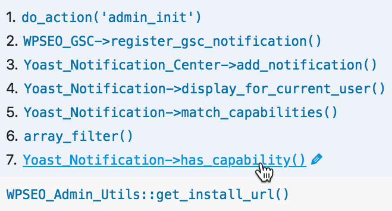
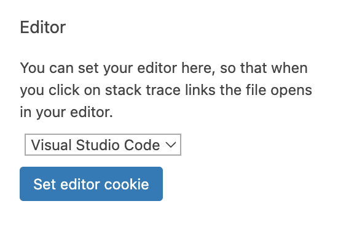

Many panels in Query Monitor display function names or stack traces. Wouldn't it be great if you could click the function name and the file opens up in your text editor or IDE at the correct position? With the clickable file links feature you can, and you'll wonder how you lived without it:



You just need to open up the Settings panel in Query Monitor (click the cog next to the Close icon) and choose your editor in the "Editor" section. That's it!



If you use an editor other than VS Code or PhpStorm then you may first need to configure it so it opens when a certain URL scheme is encountered:

* Atom: [Install the Atom Open package](https://atom.io/packages/open)
* Sublime Text: [Install the subl-handler package](https://github.com/corysimmons/subl-handler)
* Netbeans: [Follow these instructions by Simon Wheatley](https://simonwheatley.co.uk/2012/08/clickable-stack-traces-with-netbeans/)

## Remote File Path Mapping

If you're debugging a remote site or using Docker or a virtual machine, you'll need to map the path on the server to its path on your local machine so your editor doesn't try to load a non-existent file. You can do this using a filter on the `qm/output/file_path_map` hook which accepts an array of remote paths and the local path they map to.

For example, if you use the Docker-based development environment that's built in to WordPress core, your path mapping needs to look like this:

```php
add_filter( 'qm/output/file_path_map', function( $map ) {
	$map['/var/www/'] = '/path/to/wordpress/';
	return $map;
} );
```

If you use VVV your path mapping needs to look like this:

```php
add_filter( 'qm/output/file_path_map', function( $map ) {
	$map['/srv/'] = '/path/to/vvv/';
	return $map;
} );
```

If you use Chassis or another Vagrant-based VM, your path mapping needs to look like this:

```php
add_filter( 'qm/output/file_path_map', function( $map ) {
	$map['/vagrant/'] = '/path/to/local/project/';
	return $map;
} );
```

If you've changed the paths configuration in Chassis, you may need to map the `/chassis` directory instead:

```php
add_filter( 'qm/output/file_path_map', function( $map ) {
	$map['/chassis/'] = '/path/to/local/project/';
	return $map;
} );
```

## That's it!

I hope you enjoy clicking on your newly-clickable file links.
