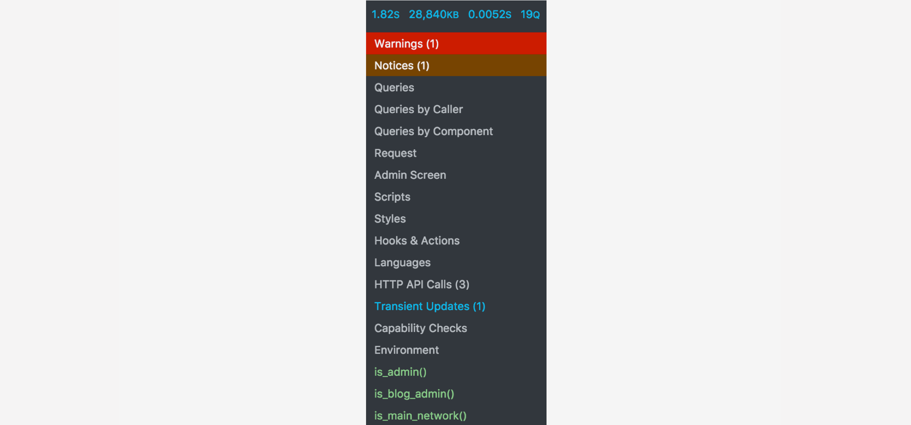
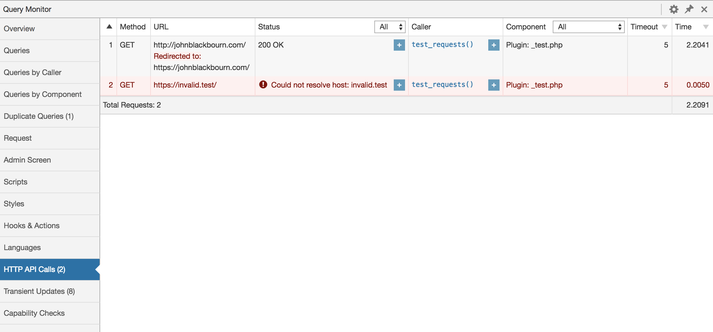

# How to use Query Monitor

## Installation

Install and activate Query Monitor as you would any other WordPress plugin. [You can download it here on WordPress.org](https://wordpress.org/plugins/query-monitor/).

## Usage

While you're logged in as an Administrator you'll see a new menu item in the admin toolbar menu:

The numbers at the top show, in order:

1. Page generation time in seconds
2. Peak memory usage
3. Total time taken by SQL queries in seconds
4. Total number of SQL queries

All of the information shown by Query Monitor is for the _current page load_. Historical information is not available (although this feature is planned for a future version).

Click the top of the menu to open the Overview panel, or click any menu item to open its corresponding panel.

Initially you'll probably be most interested in the Queries panel, which shows all of the database queries that were performed during the page load and allows you to filter and sort them and determine which component was responsible for each query.

## Debugging a Slow Site

So your site is slow and you've decided to install Query Monitor in order to identify the cause. There are a few panels that you should look at first.

### 1. Queries by Component

The Queries &rarr; Queries by Component panel shows you aggregate information about the database queries that were executed by each plugin and theme during the page load. This is a good way to identify poorly performing themes or plugins.

This panel is sorted by the total time taken for all the queries executed by each component. A plugin that performs a high number of queries, or performs queries that are slow, will contribute to the time that your site takes to load.

### 2. HTTP API Calls

The HTTP API Calls panel shows you information about the server-side HTTP requests that were performed during the page load. These are usually "invisible" causes of a slow site, and can occur sporadically.

If a plugin or theme regularly triggers an HTTP API call during the loading of a page, this will increase the time your site takes to load.

### 3. Object Cache

The Overview panel shows you information about several aspects of your site, one of which is the object cache. If you don't have a persistent object caching plugin active then Query Monitor will show you a message.

A persistent object cache plugin greatly improves performance by caching the result of operations such as database queries, HTTP API calls, and other slow operations. By default WordPress uses a non-persistent object cache, which means repeated operations within the same page load get cached but repeated operations across page loads don't.

If you see the message "External object cache not in use" then you should install an object caching plugin for a driver such as Redis or Memcached which will allow the object cache to persist across page loads and greatly improve the performance of your site. Speak to your hosting provider if you need help with this.

### 4. PHP Errors

The PHP Errors panel will appear only if some code that executed during the loading of the page caused a PHP error, such as a notice or a warning. If you see a red or orange highlight in Query Monitor's admin toolbar menu, this means an error occurred and you should investigate it.

Code that triggers a Warning means the code is not operating as expected and may be causing broken behaviour on your site. You should investigate warnings straight away. In addition, warnings can increase the time your site takes to load because each error gets logged by your server.

Code that triggers a Notice is less critical but should still be investigated as it can be indicative of poorly written code. Notices may or may not be logged by your server depending on its configuration.

### 5. Scripts and Styles

If your site loads many JavaScript or CSS files it won't necessarily slow down the page generation time on your server but it will slow down the page load time for your visitors.

The Scripts and Styles panels show you which files have been enqueued via the WordPress dependency system. If these panels show a large number of files you should consider installing a plugin which minifies and combines them.

### Everything Else

Despite its name, Query Monitor includes a large amount of functionality unrelated to database queries. For example in the Request panel you can see information about rewrite rules and query variables; in the Template panel you can see information about the theme template hierarchy and template parts; and in the Environment panel you can see configuration settings and information about your server.

Click through each of the panels and hopefully you'll find something interesting!
