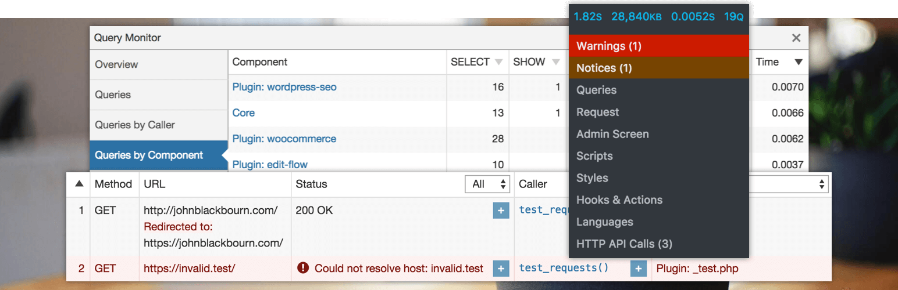

# The developer tools panel for WordPress

{: .fs-6 .fw-300 }
Query Monitor enables you to inspect and debug many aspects of your WordPress site, including:

* Database queries
* PHP errors
* HTTP API calls
* Hooks and actions
* Scripts and styles
* Theme template files
* Translations
* Rewrite rules
* Block editor blocks
* and much more...

Query Monitor focuses on presenting information in a useful manner, for example by showing database queries grouped by the plugins, themes, or functions that are responsible for them. This allows you to efficiently determine which plugins, themes, or functions are performing poorly.

Query Monitor is free and open source software, just like WordPress. It's also bundled on some of the most high-trafficked WordPress platforms in the world, including [Altis](https://www.altis-dxp.com/) and [WordPress VIP](https://wpvip.com/).

---

[Download on WordPress.org](https://wordpress.org/plugins/query-monitor/){: .btn .btn-primary .fs-5 .mr-2 }
[How to use](wordpress-debugging/how-to-use/){: .btn .fs-5 .mr-2 }
